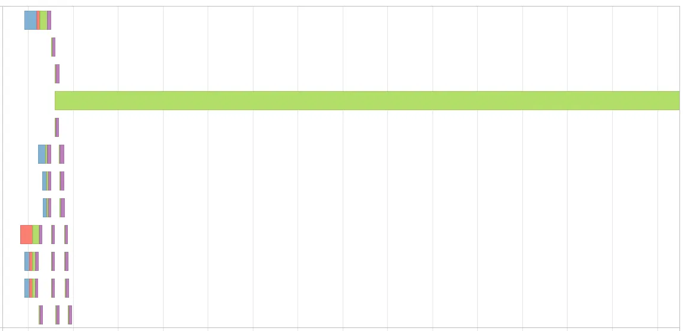
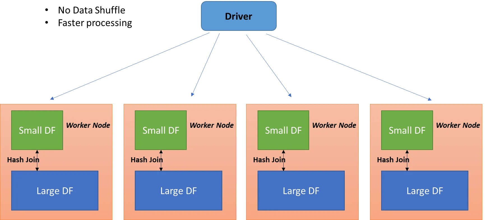
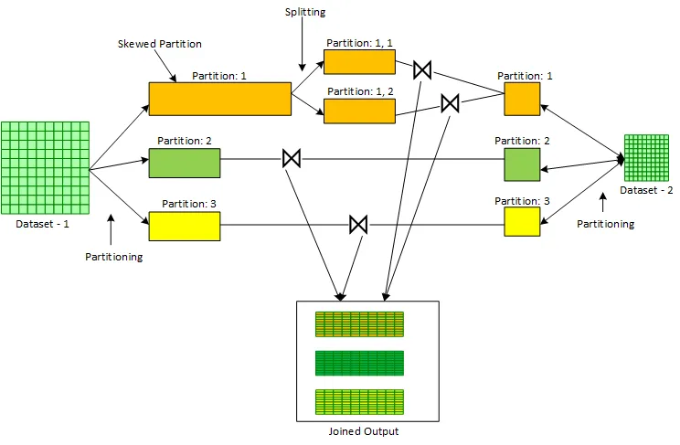

현재 업무에서 spark를 많이 쓰고 있습니다. spark을 쓰면서 data skew로 꽤나 어려움을 겪고 있었는데 이번에 skew job을 튜닝하면서 배운 점들을 정리해보았습니다. spark 뿐만 아니라 업무에서 data skew를 겪고 계신 분들 모두에게 조금이나마 도움이 되길 바랍니다!

# 글에 앞서

이 글은 **skew를 잘 풀어내는 법**보다는 **skew join을 잘 적용시키는 법**에 좀 더 가깝습니다. skew를 풀기 위해서는 broadcast join을 사용한다던가, 양쪽 dataframe에 salt key를 추가해 데이터를 고루 분산시키는 방법을 주로 많이 사용합니다. data skew는 앞에 설명한 2가지 방법을 어떻게 잘 적용시킬까?에서 출발하는 많은 사람들의 경험 혹은 창의적인 방법에 의해 발전되어 왔습니다.

skew join은 apache spark 3.0에서 추가된 AQE(Adaptive Query Execution)의 부가 기능 중 하나이며, skew라고 판단되는 파티션을 더 작은 파티션으로 분할해 자체적으로 data skew를 풀어내는 방법입니다. 다른 분산처리 프레임워크에서는 적용하기 어려운 개념일 것이며, spark에서 비슷한 상황을 겪는 사람에 한해 적용 가능한 방법이라 정공법은 아닐 수 있음을 알아주시면 좋겠습니다.

 

# data skew

data skew는 분산 처리 시 데이터가 특정 Node에 쏠리게 되는 현상입니다. 특정 node에만 과중하게 데이터가 쏠리게 되면 당연히 처리가 느려지고, job timeout 등의 우려가 높아집니다.

spark에서는 UI를 통해 비교적 쉽게 skew를 확인할 수 있습니다. spark UI를 자주 보시고 skew를 만나본 분이라면 아래와 같은 그림을 한번쯤 보셨을거라 생각합니다.

spark stage에서 특정 몇 개의 파티션의 작업이 계속 끝나지 않고 수행되다가 메모리가 터지거나 timeout이 나는 것이 skew가 일으키는 대부분의 문제입니다.

 

# how to solve

서두에서 소개했던 broadcast join이나 salt key 등이 일반적인 해결책입니다. 그러나 두 방법은 아래와 같은 한계점을 가지고 있습니다.

 

## broadcast join

driven dataframe이 너무 크면 브로드캐스트 조인을 하기가 어려워집니다. driving dataframe이 있는 노드에 driven dataframe이 모두 복사되어 노드 간 셔플이 일어나지 않고 join이 가능해지는게 브로드캐스트 조인의 큰 장점인데, 데이터 자체가 너무 크면 노드 간 네트워크 비용도 많이 들고 메모리 부하도 너무 심해집니다.

만약 몇 백억건 * 몇 억건 정도의 sort merge join을 broadcast join으로 변경하게 된다면, 거의 모든 노드에 driven dataframe의 몇억건 데이터가 올라가는 것이기 때문에 정상적으로 job이 처리되기 어려울 것입니다.

 

## salt key

이 역시 데이터가 너무 크면 적용하기가 어렵습니다. salt key의 특성상 데이터의 뻥튀기를 피할수 없는데, skew가 심할수록 데이터를 더 많은 갯수로 분할해야 하고 그만큼 더 큰 크기의 데이터로 만들어야 합니다.

몇 백억건 데이터 중 50억건 정도가 data skew를 일으키는 주범이라고 한다면, 이를 4등분만 하더라도 200억건으로 데이터를 늘려야 합니다. 데이터를 group by한 뒤 뻥튀기 시킬 데이터와 그 크기를 동적으로 조절하는 등 salt key를 효율적으로 늘려 사용하는 방법이 있긴 하지만 일반적으로는 skew 크기가 커질수록 적용하기가 까다로워집니다.

 

# Skew Join

skew join은 apache spark 3.0에서 추가된 AQE(Adaptive Query Execution)의 부가 기능 중 하나이며, skew라고 판단되는 파티션을 더 작은 파티션으로 분할해 자체적으로 data skew를 풀어내는 방법입니다. 아래 그림의 Partition: 1과 같이 파티션이 분할됩니다.

skew partition을 판단하는 기준은 **하나의 파티션이 1GB 이상의 read size를 가지면 skew임! 처럼 정량적인 기준이 아닙니다**. 데이터의 크기 혹은 job 상황에 따라 skew라고 판단할 수 있는 상황이 다르기 때문입니다.

이제 본격적인 skew join 설명을 위해 [apache spark의 공식 문서 - optimizing skew join](https://spark.apache.org/docs/latest/sql-performance-tuning.html#optimizing-skew-join)을 정독한 뒤 와주시기 바랍니다. 

AQE에서 지정하는 옵션은 **(spark stage의 median 파티션의 크기 * skewedPartitionFactor) > skewedPartitionThresholdInBytes** 일때 해당 파티션을 skew라고 판단한다 인데, 이게 잘 맞춘것 같은데도 skew join이 생각보다 잘 안걸립니다. skew join을 시도해보신 분들이라면 이 기준을 사람이 정확하게 맞춰서 적용하는 것이 생각보다 어렵다는 것을 느끼셨을 거라 생각합니다.

> A partition is considered as skewed if its size in bytes is larger than this threshold and also larger than `spark.sql.adaptive.skewJoin.skewedPartitionFactor` multiplying the median partition size. Ideally, this config should be set larger than `spark.sql.adaptive.advisoryPartitionSizeInBytes`.

skew join이 잘 걸리게 하려면 **skewedPartitionThresholdInBytes**을 아주 작게 하거나 **spark stage의 median 파티션의 크기 * skewedPartitionFactor**를 아주 크게 만들어야 합니다.

skewedPartitionThresholdInBytes을 너무 작게 잡거나 skewedPartitionFactor을 너무 큰 수로 하면 skew가 아닌 파티션까지 skew로 간주되는 경우가 많아지기 때문에 안정적인 방법은 spark stage의 median 파티션의 크기를 키우는 것입니다. 이러다보니 자연스럽게 shuffle partition의 크기를 키우는 방향으로 job을 작성하는 경향이 생겼습니다.

 

# 문제점

shuffle partition의 크기를 키우려면 갯수를 적게 잡으면 됩니다. 데이터 크기에 비해 shuffle partition 갯수를 적게 잡으면 한동안은 skew join이 잘 먹어서 job이 잘 동작합니다.

그러나 역시 문제는 데이터가 계속 커지면 발생합니다. join은 잘 되더라도 그 뒤에 group by나 window function 같은 다른 연산이 있다면 이런 무거운 연산 역시 아주 적게 잡힌 shuffle partition 안에서 이루어지게 되고, 이는 파티션의 부하로 이어지게 됩니다.

- shuffle partition 갯수를 많이 / 개별 크기를 작게 하면 -> skew join이 안먹어서 작업이 터짐
- shuffle partition 갯수를 적게 / 개별 크기를 크게 하면 -> skew join은 잘 먹는데 뒷 작업이 무거워서 터짐

이 문제를 해결하기 위해 join을 하는 작업과 join을 하지 않는 작업을 물리적으로 나눠서 실행했습니다. 실제 적용된 코드와 UI를 다음 포스팅에서 소개하도록 하겠습니다.
